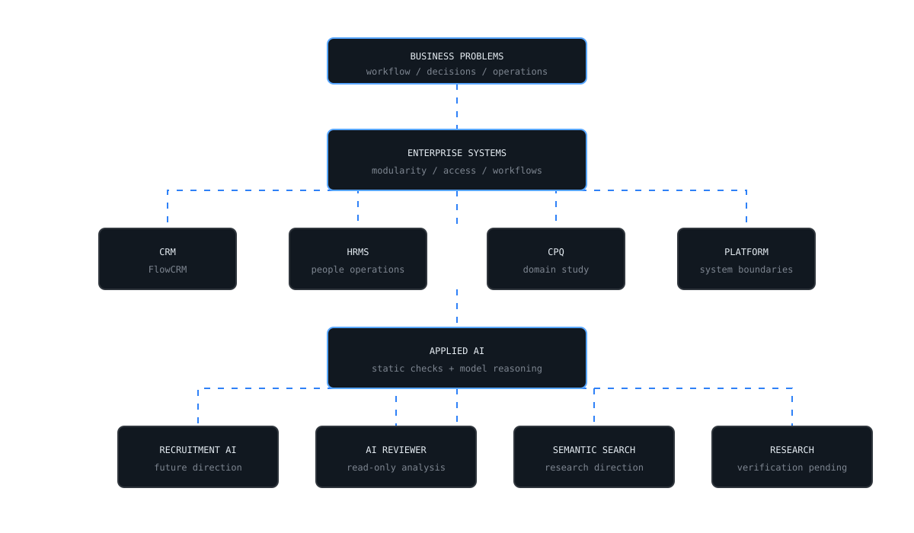
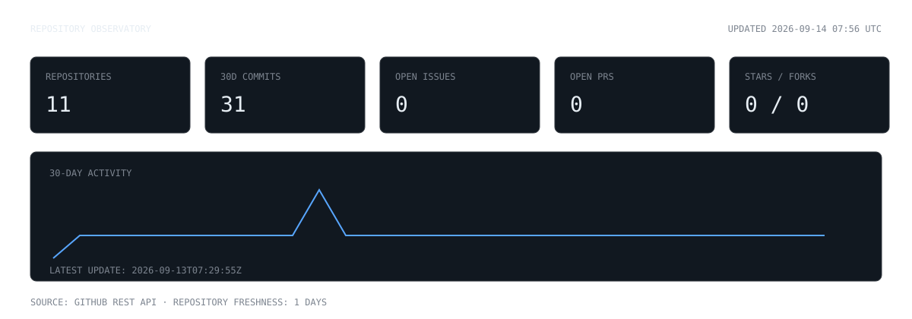

<div align="center">

# AHANA SAHA

### ENGINEERING CONTROL CENTER

`ENTERPRISE SYSTEMS` · `APPLIED AI` · `DEVELOPER TOOLING` · `RESEARCH`

<sub>Architecture notes, engineering decisions, and live repository telemetry.</sub>

</div>

---

## SYSTEM MAP

<picture>
  <source media="(prefers-color-scheme: dark)" srcset="./svg/blueprint-dark.svg">
  <source media="(prefers-color-scheme: light)" srcset="./svg/blueprint-light.svg">
  
</picture>

## REPOSITORY OBSERVATORY

<picture>
  <source media="(prefers-color-scheme: dark)" srcset="./dashboard/observatory-dark.svg">
  <source media="(prefers-color-scheme: light)" srcset="./dashboard/observatory-light.svg">
  
</picture>

The observatory is generated from the GitHub REST API every day. Until its first workflow run, the panel intentionally displays an uninitialized state rather than invented metrics.

## ENGINEERING DOMAINS

| Domain | Engineering Surface | Repository Evidence |
|---|---|---|
| Enterprise Platforms | Business workflows, role boundaries, modular service layers | [FlowCRM](https://github.com/AHANA000000045/CRM), [HRMS](https://github.com/AHANA000000045/hrms-2coms) |
| Applied AI | Model reasoning bounded by deterministic analysis and explicit safety contracts | [AI Senior Code Reviewer](https://github.com/AHANA000000045/AI-Senior-CodeReviewer) |
| Developer Tooling | IDE-integrated file and repository analysis | [AI Senior Code Reviewer](https://github.com/AHANA000000045/AI-Senior-CodeReviewer) |
| Research Systems | Embedded systems and machine-learning investigations | Publication or repository source required before expansion |

## CASE STUDIES

### 01 / FlowCRM

**Problem**  
Model a CRM as enterprise software rather than a collection of independent CRUD screens.

**Approach**  
Separate the Angular client, NestJS REST API, service layer, data models, and MongoDB persistence. Treat role-based access as a system boundary spanning both frontend and backend.

**Architecture**

```text
Angular client -> REST API -> NestJS controller -> service -> model -> MongoDB
```

**Engineering decisions**

- Organize the repository around frontend, backend, documentation, and diagrams.
- Define distinct operational roles, including organization administration, sales, support, and marketing.
- Keep the initial architecture focused by deliberately excluding extra state-management and messaging infrastructure.

[Inspect repository](https://github.com/AHANA000000045/CRM)

---

### 02 / AI Senior Code Reviewer

**Problem**  
AI code-review tools can create risk when they modify source code or replace deterministic engineering checks with opaque model output.

**Approach**  
Build a read-only VS Code extension backed by FastAPI. Combine static analyzers with model reasoning to provide warnings, architectural observations, failure predictions, and test recommendations.

**Architecture**

```text
VS Code extension -> local FastAPI service -> analyzers + scoring + AI provider
```

**Engineering decisions**

- Never edit files, create commits, or rewrite source code.
- Run Semgrep, Pylint, Bandit, and Radon when available; degrade with recorded warnings when unavailable.
- Prioritize repository structure and selected files instead of sending an entire workspace blindly to a model.
- Keep AI-provider selection configurable rather than coupling the system to one vendor.

[Inspect repository](https://github.com/AHANA000000045/AI-Senior-CodeReviewer)

---

### 03 / HRMS

**Problem**  
Represent people operations inside a dedicated system boundary.

**Current evidence**  
A public HRMS repository exists, but it does not currently expose a root README through GitHub. Architecture claims are intentionally withheld until repository documentation or implementation evidence can be verified.

[Inspect repository](https://github.com/AHANA000000045/hrms-2coms)

---

### 04 / Agentforce Direction

This is recorded as a future engineering direction, not a completed public project. It will become a case study only after implementation evidence is available in a repository.

## ENGINEERING DECISIONS

```text
CRM
Businesses operate through workflows and permissions, not isolated database forms.

AI REVIEWER
Language models should explain and prioritize deterministic findings, not silently replace them.

SEMANTIC SEARCH
Intent-aware retrieval is a research direction; no implementation claim is made here without repository evidence.

DOCUMENTATION
Architecture, APIs, data models, standards, and roadmaps belong beside the code.
```

## RESEARCH NOTEBOOK

```text
STATUS      SOURCE VERIFICATION REQUIRED
TOPICS      fall detection / embedded systems / Raspberry Pi / machine learning
POLICY      no publication title, result, or achievement is displayed without a verifiable source
```

## OPERATING PRINCIPLES

```text
01  Build around workflows.
02  Measure engineering activity; do not manufacture signals.
03  Prefer architecture decisions over framework theatre.
04  Keep AI bounded by explicit safety contracts.
05  Treat documentation as part of the system.
06  Automate repeated measurement.
```

<sub>CONTROL CENTER STATUS · public repository evidence only · telemetry refreshed daily</sub>
